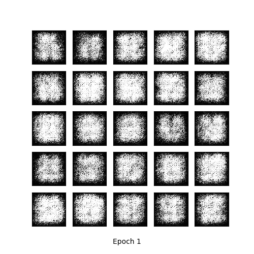

# gan (generative adversarial networks)
conditionally generate images of handwriting digits via RESTful and gRPC APIs. This repository is a toy project by Ming Li to explore the maturity of GAN with Wasserstein distance and Gradient Penalty and motivate wider application.

## Examples
### Wasserstein GANs with Gradient Penalty
  

### Conditional Wasserstein GANs with Gradient Penalty
  

## Running application
this application uses containerized flask app and Tensorflow Model Server.  

### Requirement
docker-compose >= 1.13  
or  
Python >= 3.5 and `requirement.txt`  

### Training
`python -m gan.train --epochs 20`  
to train and export model to `./bin` (default) so that Tensorflow Model Server can then load it for serving.  

### Spin up services
`docker-compose up` to start containers for web app and tensorflow serving.  

### Endpoint
`GET host:5000/generate` samples a generated image from approximated p(x).  

`POST host:5000/generate` samples a generated image from approximated p(x|c) where c ∈ {0, 1, 2, ..., 8, 9} as raw data in request.  

## Literature Review
Generative Adversarial Networks (GAN) is a framework of adversarial learning between Discriminator D(x) and Generator G(z) that aims to achieve Nash equilibrium between D and G where G(z) should successfully approximate P(x) and therefore generate realistic samples.

GAN was introduced by [Goodfellow et al 2014][1]. It was observed in subsequent research (e.g. [Arjovsky and Bottou 2017][2]) the difficult and unstable training of GANs. Two main reasons are: First, distributions P(x) and G(z) can be disjoint with supports in respective low dimensional manifolds that rarely intersect. Thus a perfect discriminator exists separating disjoint G(z) and P(x), causing gradient-based method to fail to learn and recover; Secondly, the original choice of Kullback–Leibler divergence as cost function yields large if not infinite loss even when P(x) and G(z) are close.

Gaussian noise term applied to both D(x) and G(z) and Wasserstein distance are argued in [Arjovsky and Bottou 2017][2] to soften measurement of similarity and Wasserstein GAN is formally discussed in [Arjovsky et al 2017][3].

[Gulrajani et al 2017][4] further improves the training stability with use of Gradient Penalty (GP). [Mirza and Osindero 2014][5] introduces a simple way of generating samples conditioned on class labels.

[1]: https://papers.nips.cc/paper/5423-generative-adversarial-nets.pdf  
[2]: https://arxiv.org/abs/1701.04862  
[3]: https://arxiv.org/abs/1701.07875  
[4]: https://arxiv.org/abs/1704.00028
[5]: https://arxiv.org/abs/1411.1784
